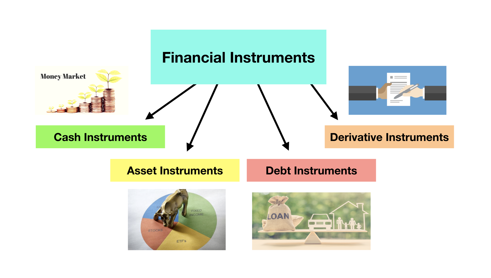
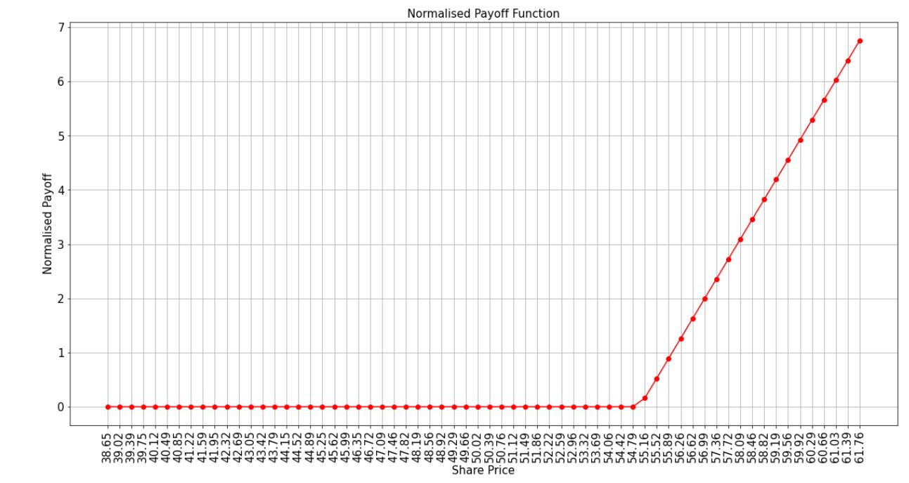
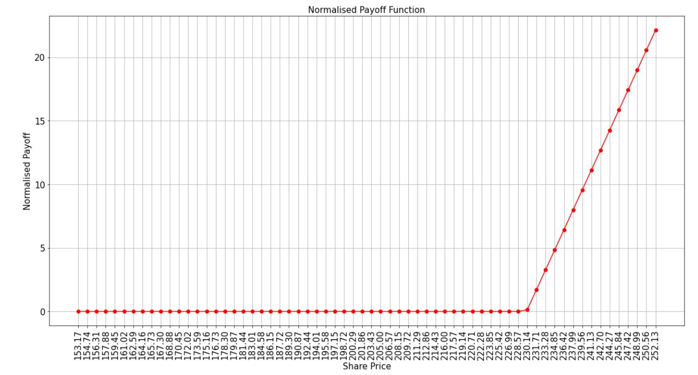

# Quantum Algorithm for payoff optimization in options using Monte Carlo sampling

## Basics of Options in finance

## Introduction

The world of finance is a complicated one to model and predict. The financial markets, in particular, are influenced by so many external factors and contain multiple different investors with different objectives. This means that traditional modelling techniques, like multiple linear regression, often struggle when trying to explain investors' behaviours or perform certain tasks in finance, such as predicting the price of a stock. Due to these complexities, we need more sophisticated models and numerous techniques have been proposed to produce such robust models for financial instruments like stocks. 

In this notebook, we discuss what types of financial instruments we can encounter in the market, particularly those that are liquid (meaning they are frequently traded and accurately valued). Illiqid instruments are also prevalent and are more difficult to evaluate and price, since they are not often traded. 

Here, we introduce a common pricing technique for a particular instrument called an option. This technique rests on Monte Carlo sampling which we show can achieve a quadratic speed up in pricing the option by replacing the classical Monte Carlo sampling approach with a quantum algorithm that leverages quantum effects to compute things faster. 

## 1. What is a financial instrument?

A financial instrument is any asset that can be traded between various parties. For example, shares of a company are equity instruments, and debt, cash and even contracts can be considered as financial instruments. 

In general, we can divide financial instruments into several categories, such as cash instruments, asset or debt-based instruments and derivative instruments. In this notebook, we will focus on the last category, namely, derivatives. These instruments get their name from the fact that their price is *derived* based on the price of a separate underlying quantity. In particular, we will consider derivatives called European options. 

### Option contracts

Options are financial derivatives that are defined explicitly by contracts. These contracts give the buyer of the option the right, but not the obligation, to buy or sell a specific underlying asset at an agreed-upon price sometime in the future. 

- Options that give the buyer the right to *buy* the underlying asset are called **call options** 

- Options that give the buyer the right to *sell* the underlying asset are called **put options**. 

In both cases, the price to buy or sell the asset at, is agreed upon in the contract and called the **strike price**.

For example, let's assume that the share price of a company called ABC is currently trading at S0 = 50 $. You believe that in 1 months time, the share price will double to 100 $. You can either buy the share now for 50 $, or you could buy a 1-month call option for a much cheaper price of 5 $. If the price of the ABC share does indeed double in 1 months time, then you can exercise your option right to buy the ABC share at the agreed up strike price (which will be lower than the actual share price). This may sound a little tricky, so let's make it concrete by going through an example with various scenarios we can encounter.

Recall that the current price of ABC is S0 = 50 $. A 1-month call option with a strike price of K =$ 80 is available to purchase for Pcall = 5 $. Let's consider the scenarios of buying an ABC share today or the call option.

#### Today:

Scenario 1: Buying a share of ABC today
Investment = $S0 = 50 $

Scenario 2: Buying a 1-month call option on ABC
Investment = Pcall = 5 $

#### In 1-months time:
Since option contracts are valid for a pre-determined period of time, their value at the expiration date is called the *payoff* that you will recieve. Technically, the price of an ABC share could be trading at any value greater than or equal to 0 $. Let's imagine that the price after 1-month St can be 40 $, 60 $ or 100 $ and look at the payoffs for each scenario. 

- St = 40 $ \
    Scenario 1: Since you own the share of ABC and purchased it at $ 50, you will lose $ 10. I.e. the payoff will be a loss of -10 $. \
    Scenario 2: The strike price is higher than the actual share price. Thus, you would not execute the option to buy ABC at K =80 $ when you can purchase the share on the market at 40 $. You will lose out on the price you paid for the call option and so the payoff will be a loss of -5 $.

- St =$ 60 $ \
Scenario 1: The payoff will be the profit you made from buying the share at 50 $ and it's current price. I.e., payoff = 60 - 50 = 10 $. \
Scenario 2: The strike price is still higher than the share price. Thus, you would not execute the option and lose 5 $.

- St =$ 100 $ \
Scenario 1: payoff = 100 - 50 = 50 $ \
Scenario 2: Here, the strike price is lower than the market price so it makes sense to execute the option. By doing so, you can buy the share at the strike price of 80 ZAR and the profit is therefore = 100 - 80 = 20 $. However, remember that you also paid a premium for the option so the total payoff is 100 - 80 - 5 = 15 $.

At this stage, you might be wondering why buy the option at all? And it kind of seems like betting? What's important to keep in mind is the initial investment you have to put up in order to buy the actual ABC share vs buying the call option. Buying the share requires a much higher investment and you run the risk of losing a lot more money if the share price drops below the price you initially paid for it. Whereas with the option, if the share price drops below the strike price, you can just let the option expire and lose a maximum of 5 $ (the price you paid for the option). There are also other reasons to purchase options, such as hedging against risk or offsetting other trades. In general, you can read more about these strategies here: https://www.investopedia.com/trading/options-strategies/

## Output for Payoff

Below are the payoff function graph for European Put and European Call option

